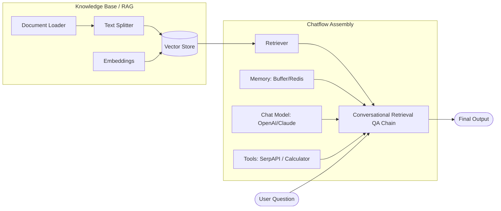
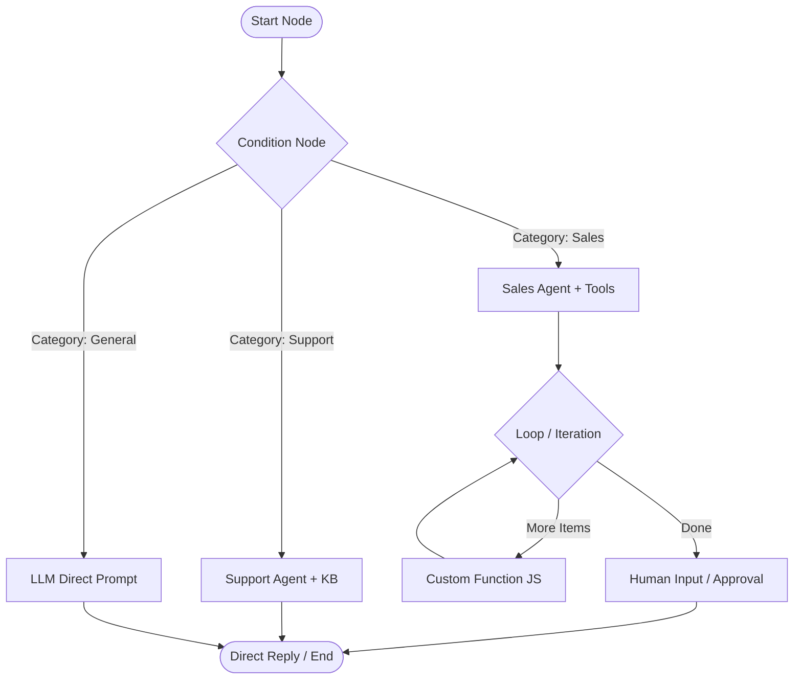
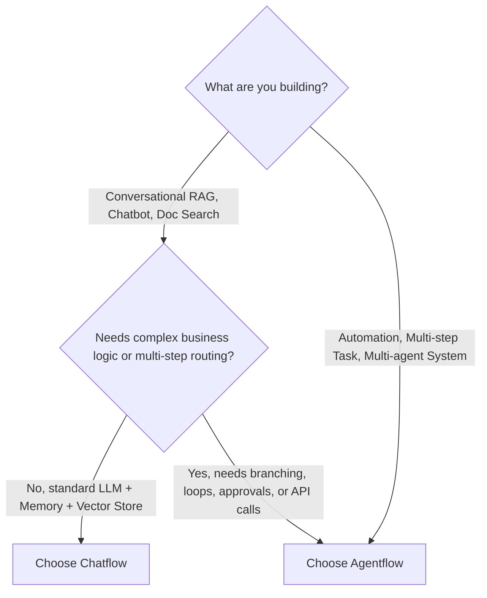

# Flowise Architecture Guide: Chatflows vs. Agentflows

Flowise provides two distinct paradigms for building LLM applications: **Chatflows** and **Agentflows**. While both leverage a visual canvas built on ReactFlow, they serve fundamentally different purposes and operate on different execution engines.

---

## 1. Executive Summary

| Dimension              | **Chatflow**                                                                                   | **Agentflow**                                                                                   |
| :--------------------- | :--------------------------------------------------------------------------------------------- | :---------------------------------------------------------------------------------------------- |
| **Paradigm**           | **Declarative Pipeline / DAG** (LangChain & LlamaIndex abstractions)                           | **Graph-based Stateful Workflow** (Deterministic logic + Agentic autonomy)                      |
| **Execution Engine**   | `buildChatflow.ts` (Topological resolution via Depth Queue into a single runnable Chain/Agent) | `buildAgentflow.ts` (Event-driven node queue runtime with state transitions & condition checks) |
| **Control Flow**       | Linear / Hierarchical composition into a root execution node                                   | Explicit branching, iterative loops, multi-agent handoffs, and sub-flows                        |
| **State & Variables**  | Implicit conversational memory (`BufferMemory`, etc.)                                          | Explicit variable references (`{{nodeId.output}}`, `{{state.key}}`, `{{question}}`)             |
| **Human-in-the-Loop**  | Not natively built-in                                                                          | Native `Human Input` node with pause/resume execution state                                     |
| **Step-Level Tracing** | LLM tracing (LangSmith, Langfuse, Phoenix)                                                     | Built-in step-by-step UI tracing via the **Executions** panel                                   |
| **Primary Focus**      | Chatbots, Question-Answering, RAG pipelines                                                    | Complex multi-step automations, autonomous agents, business logic routing                       |

---

## 2. Chatflow (Pipeline / Component Assembly)

### Concept

A **Chatflow** represents a declarative composition of AI components. It maps directly to **LangChain** and **LlamaIndex** primitives. Instead of defining step-by-step logic, you configure nodes as modular building blocks that wire into a central **Chain** or **Agent Runner**.

### Key Characteristics

1. **Component-Driven Assembly**:
    - Nodes represent functional units: **Chat Models**, **Embeddings**, **Vector Stores**, **Document Loaders**, **Memory**, **Output Parsers**, **Chains**, and **Agents**.
    - Input and output handles are typed to enforce valid LangChain graph connections (e.g., an LLM handle connects to a Chain's `model` input).
2. **Topological Execution Engine (`buildChatflow.ts`)**:
    - When a user sends a prompt, the server analyzes the flow using a `DepthQueue`.
    - It instantiates the underlying LangChain/LlamaIndex classes from leaf dependencies (like API credentials, embeddings, loaders) up to the root executor node (like `ConversationChain`, `RetrievalQA`, or `OpenAIFunctionsAgent`).
    - It executes `.invoke()` / `.call()` on the root chain and streams the response back.
3. **Implicit State & Memory**:
    - State management is delegated to LangChain memory modules (`BufferMemory`, `ZepMemory`, `UpstashRedisMemory`).

---

## 3. Agentflow (Graph Workflow Engine)

### Concept

An **Agentflow** (and the `@flowiseai/agentflow` engine) is a **graph-based workflow orchestrator**. It operates like an intelligent finite state machine where execution progresses explicitly from a `Start` node along directed edges through tasks, LLMs, conditional branches, loops, and autonomous agents.

### Key Characteristics

1. **Explicit Step-by-Step Flow**:
    - Every node in an Agentflow is an executable step that consumes inputs from predecessor nodes and emits structured outputs to successor nodes.
2. **Stateful Graph Runtime (`buildAgentflow.ts`)**:
    - Employs a runtime queue (`nodeExecutionQueue`, `waitingNodes`, `loopCounts`).
    - Supports variable references: `{{start.question}}`, `{{llm_1.data.text}}`, `{{state.userRole}}`.
    - Dynamic conditional routing: `Condition` (JavaScript expression or logical rules) and `Condition Agent` (LLM-evaluated branching).
3. **Core Agentflow Node Suite**:
    - **Start**: Configures flow entry triggers, input parameters, variables, and uploaded files.
    - **Agent**: Autonomous agent configured with system instructions, specific tools, and an LLM.
    - **LLM**: Single-turn prompt execution with structured outputs / schema parsing.
    - **Condition / Condition Agent**: Rule-based or AI-based routing paths.
    - **Loop / Iteration**: Iterating over data arrays or looping until condition satisfaction.
    - **Tool / Custom Function**: Executing custom JavaScript code or invoking external tools.
    - **HTTP**: Making external REST API requests or triggering external webhooks.
    - **Retriever**: Executing vector search / document store queries within the workflow.
    - **Human Input**: Pausing execution to wait for user interaction, review, or approval.
    - **Direct Reply**: Emitting final response to the user.
    - **Execute Flow**: Running a subflow or another Flowise chatflow/agentflow.
4. **Execution Tracing**:
    - Every execution is recorded in the `Execution` entity and can be reviewed in the **Executions** tab in the UI, showing per-node inputs, outputs, execution duration, and errors.

---

## 4. In-Depth Comparison

| Feature                | Chatflow                                | Agentflow                                                            |
| :--------------------- | :-------------------------------------- | :------------------------------------------------------------------- |
| **Architecture Base**  | LangChain / LlamaIndex Components       | Graph Runtime Engine (`@flowiseai/agentflow`)                        |
| **Flow Entry Point**   | Implicit (the target Chain/Agent node)  | Explicit `Start` Node                                                |
| **Branching Logic**    | Router Chains (limited)                 | `Condition`, `Condition Agent` (flexible rules & AI router)          |
| **Loops & Iterations** | Not supported (DAG only)                | Native `Loop` and `Iteration` nodes                                  |
| **Custom Code**        | Custom Tool (Python/JS)                 | Native `Custom Function` node executing JavaScript with state access |
| **API Integration**    | OpenAPI Tool / Custom Tool              | Native `HTTP` node (headers, body, authentication, query params)     |
| **Sub-flows**          | Limited                                 | Native `Execute Flow` node                                           |
| **Human-in-the-loop**  | No                                      | Yes (`Human Input` node with pause/resume state)                     |
| **Debugging / Logs**   | Chat Message history & external tracers | Full visual step-by-step history via **Executions** view             |

---

## 5. When to Choose Which?

### Choose **Chatflow** if:

-   You are building a **conversational chatbot** or **Q&A assistant**.
-   You want a straightforward **RAG (Retrieval-Augmented Generation)** pipeline connecting documents, vector databases, embeddings, and chat models.
-   You want to utilize ready-made LangChain chains (e.g. `ConversationalRetrievalQAChain`, `ConversationChain`).

### Choose **Agentflow** if:

-   You are building **multi-step autonomous workflows** or business process automations.
-   You require **deterministic routing** (if-else logic, category branching) alongside AI generation.
-   You need **multi-agent collaboration** where different agents handle distinct subtasks.
-   You require **Human-in-the-Loop** approval gates or interactive forms.
-   You need **loops, iterations over lists, HTTP calls to external APIs, or custom JavaScript transformations**.
