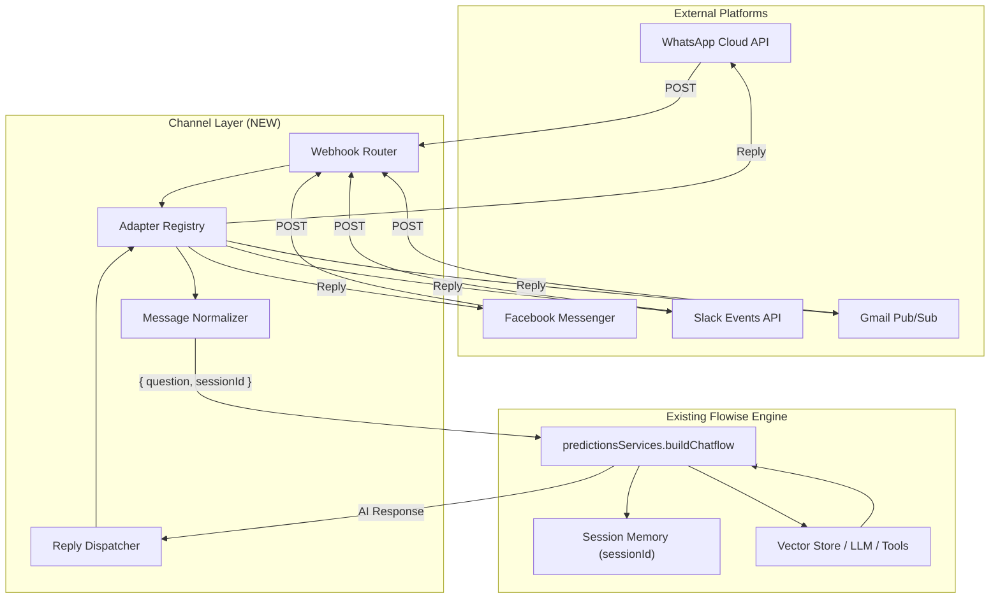

# Flowise Native Messaging Channels — High-Level Execution Plan

> **Purpose:** A step-by-step roadmap to build a native channel integration system in Flowise.
> Each step is small, self-contained, and independently executable.

---

## Architecture (Verified Against Codebase)



---

## Milestone 1: Backend Core — Channel Abstraction Layer

### Step 1 — Define Interfaces

Create [IChannelAdapter.ts](file:///media/rumon/PLANT/devxhub/workflow%20agent/Flowise/packages/server/src/channels/IChannelAdapter.ts):

| Interface              | Fields                                                                                           | Purpose                                                             |
| :--------------------- | :----------------------------------------------------------------------------------------------- | :------------------------------------------------------------------ |
| `ChannelProvider`      | `'whatsapp' \| 'facebook' \| 'slack' \| 'gmail' \| 'reddit'`                                     | Enum of supported providers                                         |
| `INormalizedMessage`   | `id, text, senderId, senderName?, conversationId, provider, channelId, rawPayload, attachments?` | Universal message shape for all platforms                           |
| `IChannelReplyContext` | `senderId, conversationId, provider, channelId`                                                  | Context needed to reply to the correct user on the correct platform |
| `IChannelAdapter`      | `provider, verifyWebhook?(), parseIncomingMessage(), sendReply()`                                | Lifecycle contract every adapter must implement                     |

---

### Step 2 — Create Channel Adapter Registry

Create [ChannelRegistry.ts](file:///media/rumon/PLANT/devxhub/workflow%20agent/Flowise/packages/server/src/channels/ChannelRegistry.ts):

-   Singleton class
-   `registerAdapter(adapter: IChannelAdapter)` — called at server boot
-   `getAdapter(provider: ChannelProvider)` — lookup by provider name
-   Follows the same singleton pattern as `NodesPool` and `RateLimiterManager`

---

### Step 3 — Database Entity & Migration

Create [Channel.ts](file:///media/rumon/PLANT/devxhub/workflow%20agent/Flowise/packages/server/src/database/entities/Channel.ts):

| Column         | Type          | Notes                                                       |
| :------------- | :------------ | :---------------------------------------------------------- |
| `id`           | `uuid (PK)`   | Auto-generated                                              |
| `name`         | `varchar`     | Human label (e.g. "My WhatsApp Bot")                        |
| `provider`     | `varchar(32)` | `whatsapp`, `facebook`, `slack`, `gmail`, `reddit`          |
| `credentialId` | `varchar`     | FK → `Credential.id`                                        |
| `chatflowId`   | `varchar`     | FK → `ChatFlow.id` (linked flow)                            |
| `webhookPath`  | `varchar`     | Auto-generated unique path                                  |
| `config`       | `text (JSON)` | Provider-specific config (verifyToken, phoneNumberId, etc.) |
| `enabled`      | `boolean`     | Toggle on/off                                               |
| `workspaceId`  | `varchar`     | Workspace scoping                                           |
| `createdDate`  | `timestamp`   | Auto                                                        |
| `updatedDate`  | `timestamp`   | Auto                                                        |

Migration files for all 4 DB dialects:

-   `sqlite/1778000000000-AddChannelEntity.ts`
-   `postgres/1778000000000-AddChannelEntity.ts`
-   `mysql/1778000000000-AddChannelEntity.ts`
-   `mariadb/1778000000000-AddChannelEntity.ts`

Register in [entities/index.ts](file:///media/rumon/PLANT/devxhub/workflow%20agent/Flowise/packages/server/src/database/entities/index.ts) and each migration index.

---

### Step 4 — Channel Service (Business Logic)

Create [services/channels/index.ts](file:///media/rumon/PLANT/devxhub/workflow%20agent/Flowise/packages/server/src/services/channels/index.ts):

| Method                                            | Purpose                                                              |
| :------------------------------------------------ | :------------------------------------------------------------------- |
| `getAllChannels(workspaceId)`                     | List all channels for a workspace                                    |
| `getChannelById(id)`                              | Get single channel                                                   |
| `createChannel(body)`                             | Create + auto-generate `webhookPath`                                 |
| `updateChannel(id, body)`                         | Update config / toggle enabled                                       |
| `deleteChannel(id)`                               | Remove channel                                                       |
| `handleIncomingWebhook(provider, channelId, req)` | **Core dispatch:** adapter.parse → buildChatflow → adapter.sendReply |

---

### Step 5 — Channel Controller & Routes

Create [controllers/channels/index.ts](file:///media/rumon/PLANT/devxhub/workflow%20agent/Flowise/packages/server/src/controllers/channels/index.ts) and [routes/channels/index.ts](file:///media/rumon/PLANT/devxhub/workflow%20agent/Flowise/packages/server/src/routes/channels/index.ts):

| Endpoint                                        | Method | Auth      | Purpose                   |
| :---------------------------------------------- | :----- | :-------- | :------------------------ |
| `/api/v1/channels`                              | GET    | ✅        | List channels             |
| `/api/v1/channels`                              | POST   | ✅        | Create channel            |
| `/api/v1/channels/:id`                          | PUT    | ✅        | Update channel            |
| `/api/v1/channels/:id`                          | DELETE | ✅        | Delete channel            |
| `/api/v1/channels/webhook/:provider/:channelId` | ALL    | ❌ Public | Incoming webhook receiver |

Register in [routes/index.ts](file:///media/rumon/PLANT/devxhub/workflow%20agent/Flowise/packages/server/src/routes/index.ts).

---

## Milestone 2: WhatsApp Cloud API Adapter (First Platform)

### Step 6 — WhatsApp Credential Definition

Create [WhatsAppCloudApi.credential.ts](file:///media/rumon/PLANT/devxhub/workflow%20agent/Flowise/packages/components/credentials/WhatsAppCloudApi.credential.ts):

| Field               | Type       | Description                            |
| :------------------ | :--------- | :------------------------------------- |
| `accessToken`       | `password` | Meta permanent system user token       |
| `phoneNumberId`     | `string`   | WhatsApp Business Phone Number ID      |
| `businessAccountId` | `string`   | WhatsApp Business Account ID           |
| `verifyToken`       | `string`   | Custom string for webhook verification |

---

### Step 7 — WhatsApp Adapter Implementation

Create [WhatsAppCloudAdapter.ts](file:///media/rumon/PLANT/devxhub/workflow%20agent/Flowise/packages/server/src/channels/adapters/WhatsAppCloudAdapter.ts):

| Method                   | Logic                                                                                                                                                 |
| :----------------------- | :---------------------------------------------------------------------------------------------------------------------------------------------------- |
| `verifyWebhook()`        | Handle Meta's `GET` with `hub.mode=subscribe` + `hub.verify_token` → return `hub.challenge`                                                           |
| `parseIncomingMessage()` | Extract from `entry[0].changes[0].value.messages[0]`: message text, sender phone (`from`), message ID                                                 |
| `sendReply()`            | `POST https://graph.facebook.com/v20.0/{phoneNumberId}/messages` with `{ messaging_product: "whatsapp", to: senderId, type: "text", text: { body } }` |

Register adapter in `ChannelRegistry` at server startup.

---

### Step 8 — End-to-End WhatsApp Webhook Test

-   Use `curl` to simulate a Meta WhatsApp webhook payload hitting `/api/v1/channels/webhook/whatsapp/:channelId`
-   Verify: message parsed → flow executed → reply dispatched
-   Test `hub.challenge` verification handshake

---

## Milestone 3: Additional Platform Adapters

### Step 9 — Facebook Messenger Adapter

Create [FacebookMessengerAdapter.ts](file:///media/rumon/PLANT/devxhub/workflow%20agent/Flowise/packages/server/src/channels/adapters/FacebookMessengerAdapter.ts):

-   Same Meta verification pattern as WhatsApp
-   Parse `messaging[0].message.text` + `messaging[0].sender.id`
-   Reply via `POST https://graph.facebook.com/v20.0/me/messages`

### Step 10 — Slack Events Adapter

Create [SlackEventsAdapter.ts](file:///media/rumon/PLANT/devxhub/workflow%20agent/Flowise/packages/server/src/channels/adapters/SlackEventsAdapter.ts):

-   Handle `url_verification` challenge response
-   Parse `event.text` + `event.user` from `event_callback` type
-   Reply via Slack Web API `chat.postMessage`

### Step 11 — Gmail Pub/Sub Adapter

Create [GmailPubSubAdapter.ts](file:///media/rumon/PLANT/devxhub/workflow%20agent/Flowise/packages/server/src/channels/adapters/GmailPubSubAdapter.ts):

-   Handle Google Cloud Pub/Sub push notification
-   Fetch new email via Gmail API using `historyId`
-   Reply via `gmail.users.messages.send`

### Step 12 — Reddit Adapter (Polling)

Create [RedditAdapter.ts](file:///media/rumon/PLANT/devxhub/workflow%20agent/Flowise/packages/server/src/channels/adapters/RedditAdapter.ts):

-   No webhook — requires a polling worker (cron-based)
-   Fetch new messages/mentions via Reddit API
-   Reply via `POST /api/comment`

---

## Milestone 4: Agentflow Canvas Integration

### Step 13 — Modify Start Node for Channel Trigger

Modify [Start.ts](file:///media/rumon/PLANT/devxhub/workflow%20agent/Flowise/packages/components/nodes/agentflow/Start/Start.ts):

-   Add `startInputType: 'channelTrigger'` option
-   Expose channel context variables:
    -   `{{$channel.senderId}}`
    -   `{{$channel.senderName}}`
    -   `{{$channel.provider}}`
    -   `{{$channel.conversationId}}`
    -   `{{$channel.rawPayload}}`

### Step 14 — New ChannelReply Node

Create [ChannelReply/ChannelReply.ts](file:///media/rumon/PLANT/devxhub/workflow%20agent/Flowise/packages/components/nodes/agentflow/ChannelReply/ChannelReply.ts):

-   Like `DirectReply` but sends response back to the originating channel
-   Inputs: `message` (text), optional `richFormat` (buttons/templates for WhatsApp)
-   Calls `adapter.sendReply()` using channel context from the execution state

---

## Milestone 5: Frontend UI — Channels Management

### Step 15 — Channels API Client

Create [ui/src/api/channels.js](file:///media/rumon/PLANT/devxhub/workflow%20agent/Flowise/packages/ui/src/api/channels.js):

-   `getAllChannels()`, `createChannel()`, `updateChannel()`, `deleteChannel()`

### Step 16 — Channels List View

Create [ui/src/views/channels/index.jsx](file:///media/rumon/PLANT/devxhub/workflow%20agent/Flowise/packages/ui/src/views/channels/index.jsx):

-   Card grid with provider icon, name, linked flow name, enabled/disabled badge
-   Toggle switch to enable/disable
-   Delete button

### Step 17 — Add/Edit Channel Dialog

Create [ui/src/views/channels/AddChannelDialog.jsx](file:///media/rumon/PLANT/devxhub/workflow%20agent/Flowise/packages/ui/src/views/channels/AddChannelDialog.jsx):

-   Step 1: Select provider (WhatsApp, Facebook, Slack, Gmail, Reddit)
-   Step 2: Select or create credential
-   Step 3: Select target Chatflow or Agentflow
-   Step 4: Show auto-generated Webhook URL + Verify Token with copy buttons

### Step 18 — Sidebar Navigation

Modify sidebar menu config to add **"Channels"** item:

-   Icon: messaging/channel icon
-   Position: after Agentflows, before Tools
-   Route: `/channels`

### Step 19 — Route Registration

Add `/channels` route to the React Router config in the UI app.

---

## Milestone 6: Testing & Documentation

### Step 20 — Tests & Verification

| Test                           | What to Verify                                                        |
| :----------------------------- | :-------------------------------------------------------------------- |
| **Unit: Adapter parsing**      | Mock WhatsApp/FB/Slack payloads → correct `INormalizedMessage` output |
| **Unit: Webhook verification** | Meta `hub.challenge`, Slack `url_verification`                        |
| **Integration: Channel CRUD**  | Create/Read/Update/Delete via API                                     |
| **Integration: Full dispatch** | Webhook → parse → buildChatflow → reply                               |
| **UI: Channel management**     | Create channel, copy webhook URL, toggle enable/disable               |

---

## File Map Summary

```
packages/
├── server/src/
│   ├── channels/
│   │   ├── IChannelAdapter.ts              ← Step 1
│   │   ├── ChannelRegistry.ts              ← Step 2
│   │   └── adapters/
│   │       ├── WhatsAppCloudAdapter.ts     ← Step 7
│   │       ├── FacebookMessengerAdapter.ts ← Step 9
│   │       ├── SlackEventsAdapter.ts       ← Step 10
│   │       ├── GmailPubSubAdapter.ts       ← Step 11
│   │       └── RedditAdapter.ts            ← Step 12
│   ├── database/
│   │   ├── entities/
│   │   │   ├── Channel.ts                  ← Step 3
│   │   │   └── index.ts                    ← Step 3 (modify)
│   │   └── migrations/
│   │       ├── sqlite/1778...-AddChannel.. ← Step 3
│   │       ├── postgres/1778...-AddChannel ← Step 3
│   │       ├── mysql/1778...-AddChannel..  ← Step 3
│   │       └── mariadb/1778...-AddChannel. ← Step 3
│   ├── services/channels/index.ts          ← Step 4
│   ├── controllers/channels/index.ts       ← Step 5
│   ├── routes/channels/index.ts            ← Step 5
│   └── routes/index.ts                     ← Step 5 (modify)
├── components/
│   ├── credentials/
│   │   └── WhatsAppCloudApi.credential.ts  ← Step 6
│   └── nodes/agentflow/
│       ├── Start/Start.ts                  ← Step 13 (modify)
│       └── ChannelReply/ChannelReply.ts    ← Step 14
└── ui/src/
    ├── api/channels.js                     ← Step 15
    └── views/channels/
        ├── index.jsx                       ← Step 16
        └── AddChannelDialog.jsx            ← Step 17
```

---

## Recommended Execution Order

> Start small. Each step is independently testable.

| Priority      | Steps       | What You Get                                             |
| :------------ | :---------- | :------------------------------------------------------- |
| **Do First**  | Steps 1–5   | Core channel backend (entity, CRUD API, dispatch engine) |
| **Do Second** | Steps 6–8   | Working WhatsApp integration (end-to-end)                |
| **Do Third**  | Steps 15–19 | UI to manage channels visually                           |
| **Do Later**  | Steps 9–12  | Facebook, Slack, Gmail, Reddit adapters                  |
| **Do Last**   | Steps 13–14 | Agentflow canvas nodes (ChannelReply, Start trigger)     |
| **Ongoing**   | Step 20     | Tests at each milestone                                  |
