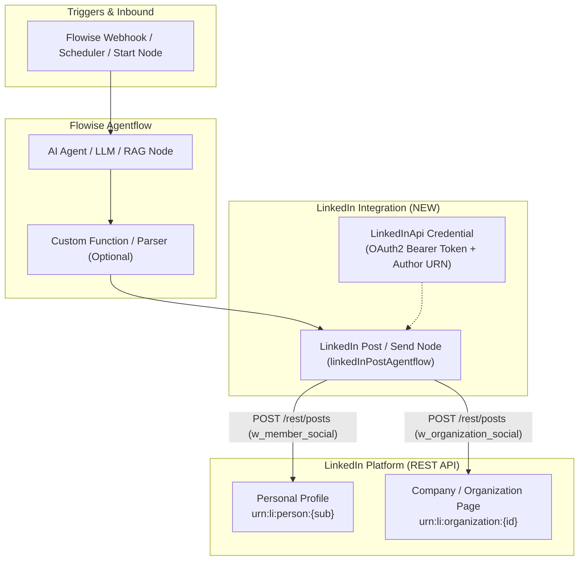

# LinkedIn Integration Implementation Plan

Integrate LinkedIn into Flowise following the same architectural pattern used for **WhatsApp**, **Facebook**, and **Telegram**. This enables AI agents and workflows to publish posts, share links, and interact with LinkedIn Personal Profiles and Company/Organization Pages.

---

## Architecture Overview



---

## Comparison: How LinkedIn Fits Flowise Channels

| Platform     | Channel Type                              | Inbound Trigger                            | Outbound Agentflow Node                                       | Target ID Resolution                        |
| :----------- | :---------------------------------------- | :----------------------------------------- | :------------------------------------------------------------ | :------------------------------------------ |
| **WhatsApp** | Direct Messaging                          | Meta Webhook (`POST /webhook/:id`)         | `WhatsAppSend`                                                | Phone number (`from`)                       |
| **Facebook** | DM + Page Posts                           | Meta Webhook (`POST /webhook/:id`)         | `FacebookMessengerSend` / `FacebookPagePost` / `FacebookSend` | Recipient PSID / Page ID                    |
| **Telegram** | Direct + Group Chat                       | Telegram Bot Webhook (`POST /webhook/:id`) | `TelegramSend`                                                | Chat ID (`message.chat.id`)                 |
| **LinkedIn** | Social Feed / Company Updates / Lead Sync | Scheduler / Webhook / Agent Flow           | **`LinkedInPost`**                                            | Auto-detected Person URN or Organization ID |

> [!NOTE]
> Unlike WhatsApp/Telegram/Facebook Messenger (which have open 1:1 chat webhooks), LinkedIn restricts 1:1 direct member messaging (InMail/DMs) to Enterprise Partner programs. Therefore, LinkedIn integration natively focuses on **automated content publishing, thought leadership, article sharing, and company page posts**.

---

## Proposed Changes

### 1. Components Package (`packages/components`)

#### [NEW] [`LinkedInApi.credential.ts`](file:///media/rumon/PLANT/devxhub/workflow%20agent/Flowise/packages/components/credentials/LinkedInApi.credential.ts)

-   **Name**: `linkedInApi`
-   **Label**: `LinkedIn API`
-   **Category**: `Credentials`
-   **Fields**:
    -   `accessToken` (Password / Token): OAuth 2.0 Bearer access token from LinkedIn Developer App.
    -   `authorType` (Options): `Personal Profile` or `Organization / Company Page`.
    -   `organizationId` (String, optional): LinkedIn Organization / Company ID (e.g. `12345678`) when publishing to a company page.
    -   `clientSecret` (Password, optional): LinkedIn Client Secret for webhook signature verification.

#### [NEW] [`LinkedInPost.ts`](file:///media/rumon/PLANT/devxhub/workflow%20agent/Flowise/packages/components/nodes/agentflow/LinkedInPost/LinkedInPost.ts)

-   **Name**: `linkedInPostAgentflow`
-   **Label**: `LinkedIn Post`
-   **Category**: `Agent Flows`
-   **Color**: `#0A66C2` (Official LinkedIn Blue)
-   **Icon**: `linkedin.svg`
-   **Inputs**:
    -   `targetType` (Options): `Personal Profile` vs `Organization / Company Page`.
    -   `organizationId` (String, optional): Target organization ID; defaults to credential if set.
    -   `postType` (Options): `Text Only` vs `Article / Link Preview`.
    -   `commentary` / `messageText` (String, multi-line): Post content and commentary generated by agent. Supports variables (`{{ agent_0.output }}`).
    -   `linkUrl` (String, optional): URL to share with automatic card preview.
    -   `linkTitle` & `linkDescription` (String, optional): Custom title/description overrides for shared links.
    -   `visibility` (Options): `PUBLIC` (default) or `CONNECTIONS`.
    -   `continueOnFail` (Boolean, default `false`): Return error message in output instead of aborting flow.
-   **Smart Features**:
    -   **Auto Person URN Resolution**: If target is `Personal Profile` and no URN is provided, automatically calls `/v2/userinfo` using the Bearer token to retrieve the user's `sub` (`urn:li:person:{sub}`).
    -   **Multi-Tenant Dynamic Overrides**: Supports `overrideConfig.vars.userLinkedInToken` and `overrideConfig.vars.userLinkedInAuthorUrn`.
    -   **Modern REST API**: Uses versioned LinkedIn API `https://api.linkedin.com/rest/posts` with `LinkedIn-Version: 202401` and `X-Restli-Protocol-Version: 2.0.0`.

#### [NEW] [`linkedin.svg`](file:///media/rumon/PLANT/devxhub/workflow%20agent/Flowise/packages/components/nodes/agentflow/LinkedInPost/linkedin.svg)

-   Vector icon for the LinkedIn node matching Flowise Agentflow canvas aesthetics.

#### [NEW] [`LinkedInPost.test.ts`](file:///media/rumon/PLANT/devxhub/workflow%20agent/Flowise/packages/components/nodes/agentflow/LinkedInPost/LinkedInPost.test.ts)

-   Comprehensive Jest unit tests covering:
    -   Node metadata and configuration validation.
    -   Personal profile text post generation.
    -   Company page article/link post generation.
    -   Auto-resolution of personal URN via `/v2/userinfo`.
    -   Missing token and validation failure scenarios.
    -   `continueOnFail` handling.

---

### 2. Server Package (`packages/server`)

#### [MODIFY] [`webhook/index.ts`](file:///media/rumon/PLANT/devxhub/workflow%20agent/Flowise/packages/server/src/controllers/webhook/index.ts)

-   Add noise filtering / event handling for LinkedIn incoming webhook notifications (e.g. Lead Gen forms, organization post mentions/comments), ensuring echo/status payloads are acknowledged cleanly without unnecessary LLM runs.

---

### 3. Templates & Documentation

#### [NEW] [`chatflows/linkedin_post_agentflow.json`](file:///media/rumon/PLANT/devxhub/workflow%20agent/Flowise/chatflows/linkedin_post_agentflow.json)

-   Sample importable Agentflow template connecting:
    `Start / Webhook Node` $\rightarrow$ `LLM / Agent Node` (drafts social post) $\rightarrow$ `LinkedIn Post Node`.

#### [NEW] [`artifacts/linkedin_integration_guide.md`](file:///media/rumon/PLANT/devxhub/workflow%20agent/Flowise/artifacts/linkedin_integration_guide.md)

-   Step-by-step guide for creating a LinkedIn Developer App, requesting required permissions (`w_member_social`, `w_organization_social`), generating OAuth tokens, and setting up the workflow.

---

## Verification Plan

### Automated Tests

1. Run LinkedIn Post unit tests:
    ```bash
    NODE_OPTIONS="--max-old-space-size=4096" pnpm --filter flowise-components exec jest nodes/agentflow/LinkedInPost/LinkedInPost.test.ts
    ```
2. Verify all social channel agentflow nodes pass (WhatsApp, Facebook, Telegram, LinkedIn):
    ```bash
    NODE_OPTIONS="--max-old-space-size=4096" pnpm --filter flowise-components exec jest nodes/agentflow/WhatsAppSend nodes/agentflow/FacebookSend nodes/agentflow/TelegramSend nodes/agentflow/LinkedInPost
    ```
3. Compile components:
    ```bash
    pnpm --filter flowise-components build
    ```

### Manual Verification

1. Verify `LinkedIn API` appears in Flowise Credentials menu.
2. Verify `LinkedIn Post` appears in Flowise Agentflow canvas under `Agent Flows`.
3. Test publishing to LinkedIn with a sample bearer token.
