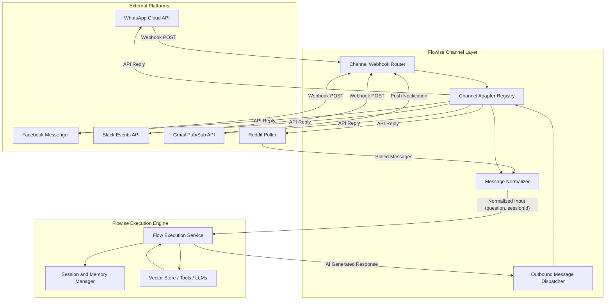

# Native Messaging Channels Integration System in Flowise

## Goal

Build a native, production-grade **Messaging Channel Integration System** inside Flowise (supporting **WhatsApp Business**, **Facebook Messenger**, **Slack**, **Gmail**, and **Reddit**). This allows users to connect their communication channels directly to any Chatflow or Agentflow without needing external middleware or bridges, automatically routing inbound messages to AI flows and delivering synthesized responses back to the original platform.

---

## User Review Required

> [!IMPORTANT] > **Disk Space Status:** The `/home` partition currently has **6.0 GB available** (healthy). All artifacts, files, and builds can now be written and executed without disk space errors.

> [!IMPORTANT] > **Recommended Phased Rollout:**
>
> 1. **Phase 1 & 2 First (Recommended)**: Implement the core channel architecture + **WhatsApp Business Cloud API** adapter + UI management page first.
> 2. **Subsequent Phases**: Expand to Facebook Messenger, Slack Events, Gmail API, and Reddit.

---

## Architecture Overview



---

## Proposed Changes

### 1. Backend Core & Channel Abstraction Layer

#### [NEW] [IChannelAdapter.ts](file:///media/rumon/PLANT/devxhub/workflow%20agent/Flowise/packages/server/src/channels/IChannelAdapter.ts)

-   `INormalizedMessage`: Standard interface for all platforms:
    ```typescript
    export interface INormalizedMessage {
        id: string
        text: string
        senderId: string // e.g. Phone number, Slack user ID, Email address
        senderName?: string
        conversationId: string // Unique session/thread ID
        provider: ChannelProvider
        channelId: string
        rawPayload: any
        attachments?: Array<{ type: string; url: string; mimeType: string }>
    }
    ```
-   `IChannelAdapter`: Unified lifecycle interface for channel adapters:
    ```typescript
    export interface IChannelAdapter {
        provider: ChannelProvider
        verifyWebhook?(req: Request, res: Response, channel: Channel): Promise<boolean | Response>
        parseIncomingMessage(req: Request, channel: Channel): Promise<INormalizedMessage | null>
        sendReply(message: string, context: IChannelReplyContext, channel: Channel): Promise<boolean>
    }
    ```

#### [NEW] [ChannelRegistry.ts](file:///media/rumon/PLANT/devxhub/workflow%20agent/Flowise/packages/server/src/channels/ChannelRegistry.ts)

-   Singleton registry registering all active channel adapters (`whatsapp`, `facebook`, `slack`, `gmail`, `reddit`).

#### [NEW] [Channel.ts Entity](file:///media/rumon/PLANT/devxhub/workflow%20agent/Flowise/packages/server/src/database/entities/Channel.ts)

-   Database entity storing configured channels:
    -   `id`: UUID
    -   `name`: Human-readable channel name
    -   `provider`: `'whatsapp' | 'facebook' | 'slack' | 'gmail' | 'reddit'`
    -   `credentialId`: Reference to stored credentials (API tokens, OAuth tokens, secrets)
    -   `chatflowId`: Linked Chatflow or Agentflow ID
    -   `webhookPath`: Auto-generated unique webhook path / URL
    -   `config`: Additional JSON config (verify token, phone number ID, bot user ID, auto-reply settings)
    -   `enabled`: Boolean toggle
    -   `createdDate`, `updatedDate`

#### [NEW] [Channels Route, Controller & Service](file:///media/rumon/PLANT/devxhub/workflow%20agent/Flowise/packages/server/src/routes/channels/index.ts)

-   `GET /api/v1/channels`: List channels
-   `POST /api/v1/channels`: Create a new channel
-   `PUT /api/v1/channels/:id`: Update channel config / status
-   `DELETE /api/v1/channels/:id`: Remove channel
-   `ALL /api/v1/channels/webhook/:provider/:channelId`: Public webhook receiver for incoming platform messages and verification handshakes.

---

### 2. Platform Channel Adapters

#### [NEW] [WhatsAppCloudAdapter.ts](file:///media/rumon/PLANT/devxhub/workflow%20agent/Flowise/packages/server/src/channels/adapters/WhatsAppCloudAdapter.ts)

-   Implements Meta `hub.challenge` verification for webhook setup.
-   Parses Meta WhatsApp message payloads (`entry[0].changes[0].value.messages[0]`).
-   Dispatches AI reply via `POST https://graph.facebook.com/v20.0/{phoneNumberId}/messages`.

#### [NEW] [WhatsAppCloudApi.credential.ts](file:///media/rumon/PLANT/devxhub/workflow%20agent/Flowise/packages/components/credentials/WhatsAppCloudApi.credential.ts)

-   Credential definition for `WhatsApp Cloud API`:
    -   `accessToken` (Permanent system user access token)
    -   `phoneNumberId`
    -   `businessAccountId`
    -   `verifyToken`

#### [NEW] [FacebookMessengerAdapter.ts](file:///media/rumon/PLANT/devxhub/workflow%20agent/Flowise/packages/server/src/channels/adapters/FacebookMessengerAdapter.ts)

-   Handles Meta Messenger webhook verification & message events.
-   Replies via Graph API `POST https://graph.facebook.com/v20.0/me/messages`.

#### [NEW] [SlackEventsAdapter.ts](file:///media/rumon/PLANT/devxhub/workflow%20agent/Flowise/packages/server/src/channels/adapters/SlackEventsAdapter.ts)

-   Handles Slack `url_verification` challenge and `message` events.
-   Replies via Slack Web API `chat.postMessage`.

#### [NEW] [GmailPubSubAdapter.ts](file:///media/rumon/PLANT/devxhub/workflow%20agent/Flowise/packages/server/src/channels/adapters/GmailPubSubAdapter.ts)

-   Handles Google Cloud Pub/Sub push webhooks for incoming customer emails.
-   Extracts email body & sender, replies via Gmail API `users.messages.send`.

---

### 3. Agentflow / Chatflow Canvas Integration

#### [MODIFY] [Start.ts](file:///media/rumon/PLANT/devxhub/workflow%20agent/Flowise/packages/components/nodes/agentflow/Start/Start.ts)

-   Add option to declare channel trigger inputs (`{{$channel.senderId}}`, `{{$channel.provider}}`, `{{$channel.raw}}`).

#### [NEW] [ChannelReply.ts](file:///media/rumon/PLANT/devxhub/workflow%20agent/Flowise/packages/components/nodes/agentflow/ChannelReply/ChannelReply.ts)

-   Dedicated node to explicitly format and deliver replies to the active inbound channel, supporting rich formatting, buttons, or custom templates.

---

### 4. Frontend UI: Channels Management

#### [NEW] [Channels View](file:///media/rumon/PLANT/devxhub/workflow%20agent/Flowise/packages/ui/src/views/channels/index.jsx)

-   Added to the primary sidebar navigation alongside **Chatflows**, **Agentflows**, **Marketplaces**, and **Credentials**.
-   Card grid showing active channels, provider badges, connected flow names, and live toggle switches.
-   **Add / Edit Channel Modal**:
    -   Step 1: Select Channel Provider (WhatsApp, Facebook, Slack, Gmail, Reddit).
    -   Step 2: Select or create required Credential.
    -   Step 3: Select target Chatflow or Agentflow to execute.
    -   Step 4: Display auto-generated Webhook URL & Verify Token with 1-click copy buttons.
    -   Step 5: Test Connection / Send Test Inbound Payload.

---

## Verification Plan

### Automated Tests

1. **Adapter Unit Tests**:
    - Test webhook challenge verifications (Meta `hub.challenge`, Slack `url_verification`).
    - Test message normalization with mock payloads from WhatsApp, Facebook, Slack, Gmail.
2. **Channel Controller Integration Tests**:
    - `npm run test` on `packages/server`.

### Manual Verification

1. **WhatsApp Webhook Simulation**:
    - Trigger the Flowise Channel webhook with a mock WhatsApp Cloud API payload using `curl`.
    - Verify Flowise extracts the question, queries the connected RAG flow with `sessionId = sender_phone_number`, and invokes the outbound reply handler.
2. **UI Verification**:
    - Create a WhatsApp Channel via the UI, connect a flow, copy the webhook URL, toggle channel on/off.
