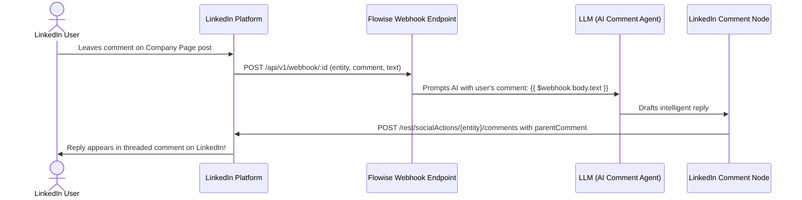

# LinkedIn Integration & Comment Webhook Guide for Flowise

This guide explains how to set up **LinkedIn Developer App permissions**, publish posts, and configure the **LinkedIn Comment Webhook ("Comment Hook")** to automatically reply to comments on your LinkedIn posts using AI.

---

## 1. Prerequisites on LinkedIn Developer Portal

To post and auto-reply to comments on LinkedIn via API, you need:

1. A LinkedIn personal account.
2. Admin access to your LinkedIn Company Page.
3. A developer app created on the [LinkedIn Developer Portal](https://developer.linkedin.com/).

---

## 2. Developer App Setup & Permissions

### Step 2.1: Create the App

1. Go to the [LinkedIn Developer Portal](https://www.linkedin.com/developers/apps).
2. Click **Create app** and associate your LinkedIn Company Page.
3. In **Settings** $\rightarrow$ **Company Page verification**, verify page ownership.

### Step 2.2: Add Products (Required Permissions)

Under the **Products** tab in your app:

1. **Share on LinkedIn** $\rightarrow$ Click **Request access** (grants `w_member_social` for personal posts).
2. **Sign In with LinkedIn using OpenID Connect** $\rightarrow$ Click **Request access** (grants `openid`, `profile`).
3. **Community Management API** $\rightarrow$ Click **Request access** (grants `w_organization_social` and `rw_organization_admin` for posting to your Company Page and replying to comments).

---

## 3. Generate an Access Token

In the Developer Portal, go to **Tools** $\rightarrow$ **OAuth Token Generator**:

1. Select your app.
2. Select scopes:
    - `w_organization_social` (to post and comment as Company Page)
    - `w_member_social` (to post as Personal Profile)
    - `openid`, `profile`
3. Click **Request token** and copy the generated **Bearer Access Token**.

---

## 4. How the "Comment Hook" Works: Auto-Replying with AI

To have an AI agent automatically reply whenever a user comments on your post, LinkedIn notifies Flowise via an incoming webhook:



---

## 5. Setting Up the Auto-Reply Flow in Flowise

### Step 5.1: Import the Agentflow Template

Import [`chatflows/linkedin_org_comment_agentflow.json`](file:///media/rumon/PLANT/devxhub/workflow%20agent/Flowise/chatflows/linkedin_org_comment_agentflow.json) into your Flowise workspace:

1. **Start Node**:
    - Set **Input Type** to `Webhook Trigger`.
    - Copy your Flowise Webhook URL:
      `https://<your-flowise-url>/api/v1/webhook/<chatflowId>`
2. **LLM Node (LinkedIn Comment Assistant)**:
    - Connect your LLM credential (OpenAI, Anthropic, Gemini, Groq).
    - Prompt: `"A user left the following comment: '{{ $webhook.body.text }}'. Reply helpfully and professionally as our company brand."`
3. **LinkedIn Comment Node (`LinkedInComment`)**:
    - Connect your **`linkedInApi`** credential.
    - **Actor Type**: `Company / Organization Page`.
    - **Target Post URN**: Default `{{ $webhook.body.entity }}`.
    - **Comment Type**: `Reply to an Existing Comment`.
    - **Parent Comment URN**: Default `{{ $webhook.body.comment }}`.
    - **Comment Text**: `{{ llmAgentflow_0.output.content }}`.
    - **Continue on Fail**: `true`.

---

## 6. Webhook Payload Format & Testing

When LinkedIn (or a webhook forwarder) sends an event to Flowise, the payload format is:

```json
{
    "event": "ORGANIZATION_SOCIAL_ACTION",
    "actionType": "COMMENT",
    "entity": "urn:li:share:7123456789012345678",
    "comment": "urn:li:comment:(urn:li:share:7123456789012345678,987654321)",
    "actor": "urn:li:person:user12345",
    "text": "Great update! Does this integrate with existing CRM workflows?",
    "organization": "urn:li:organization:12345678"
}
```

### Test the Comment Hook Locally with `curl`:

You can test your entire AI auto-reply workflow by simulating an incoming comment webhook:

```bash
curl -X POST "https://<your-flowise-url>/api/v1/webhook/<YOUR_CHATFLOW_ID>" \
  -H "Content-Type: application/json" \
  -d '{
    "event": "ORGANIZATION_SOCIAL_ACTION",
    "actionType": "COMMENT",
    "entity": "urn:li:share:7123456789",
    "comment": "urn:li:comment:(urn:li:share:7123456789,987654321)",
    "actor": "urn:li:person:abcdef",
    "text": "How do you handle rate limits on the API?",
    "organization": "urn:li:organization:12345678"
  }'
```

> [!TIP] > **Built-In Infinite Loop Protection**:
> Flowise's Webhook Controller automatically detects if the comment's `actor` matches your own `organization`. When your agent posts a reply, LinkedIn triggers a webhook for the new reply — Flowise automatically drops this self-echo to ensure your AI never replies to itself in an infinite loop.
