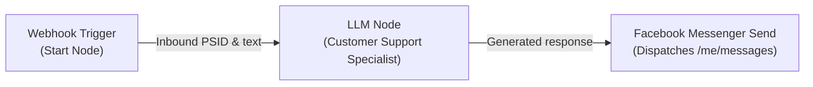

# Walkthrough: Facebook Messenger & Page Post Node Separation

The unified `FacebookSend` node has been refactored and separated into two dedicated, focused nodes under **Agent Flows**:
1. **[FacebookMessengerSend.ts](file:///media/rumon/PLANT/devxhub/workflow%20agent/Flowise/packages/components/nodes/agentflow/FacebookMessengerSend/FacebookMessengerSend.ts)** (1-to-1 conversational Messenger responses)
2. **[FacebookPagePost.ts](file:///media/rumon/PLANT/devxhub/workflow%20agent/Flowise/packages/components/nodes/agentflow/FacebookPagePost/FacebookPagePost.ts)** (1-to-many Page timeline and feed publishing)

Both nodes share the existing [FacebookPageApi.credential.ts](file:///media/rumon/PLANT/devxhub/workflow%20agent/Flowise/packages/components/credentials/FacebookPageApi.credential.ts) credential and support dynamic token resolution via `overrideConfig`.

---

## 1. Node Specifications

### 💬 Facebook Messenger Send
- **Location**: `packages/components/nodes/agentflow/FacebookMessengerSend/`
- **Label**: `Facebook Messenger Send`
- **Type**: `FacebookMessengerSend`
- **Category**: `Agent Flows`
- **Color**: `#0084FF` (Messenger Blue)
- **Icon**: `messenger.svg`
- **Credential**: `facebookPageApi`
- **Inputs**:
  - `Recipient PSID`: `recipientId` (Default: `{{ $webhook.body.entry[0].messaging[0].sender.id }}`)
  - `Message Text`: `messageText` (Multi-line input / dynamic variable input)
  - `Continue on Fail`: `continueOnFail` (Optional boolean)
- **API Endpoint**: `POST https://graph.facebook.com/v20.0/me/messages`

### 📢 Facebook Page Post
- **Location**: `packages/components/nodes/agentflow/FacebookPagePost/`
- **Label**: `Facebook Page Post`
- **Type**: `FacebookPagePost`
- **Category**: `Agent Flows`
- **Color**: `#1877F2` (Facebook Blue)
- **Icon**: `facebook.svg`
- **Credential**: `facebookPageApi`
- **Inputs**:
  - `Page ID`: `pageId` (Optional, defaults to Credential / `me`)
  - `Post Content`: `messageText` (Multi-line input / dynamic variable input)
  - `Link URL`: `linkUrl` (Optional URL attached to post)
  - `Continue on Fail`: `continueOnFail` (Optional boolean)
- **API Endpoint**: `POST https://graph.facebook.com/v20.0/${pageId}/feed`

---

## 2. Updated Flow Templates

The sample Agentflow template [`facebook_messenger_agentflow.json`](file:///media/rumon/PLANT/devxhub/workflow%20agent/Flowise/chatflows/facebook_messenger_agentflow.json) has been updated to use the new `FacebookMessengerSend` node:



---

## 3. Test & Verification Results

### Automated Unit Tests
Executed via Jest:
```
PASS packages/components/nodes/agentflow/FacebookPagePost/FacebookPagePost.test.ts
  FacebookPagePost Node
    ✓ should have correct node metadata (4 ms)
    ✓ should publish post to Page feed (2 ms)
    ✓ should throw error when message text is empty (8 ms)

PASS packages/components/nodes/agentflow/FacebookMessengerSend/FacebookMessengerSend.test.ts
  FacebookMessengerSend Node
    ✓ should have correct node metadata (2 ms)
    ✓ should dispatch Messenger reply using recipient PSID (1 ms)
    ✓ should throw error when recipient PSID is missing (4 ms)

Test Suites: 2 passed, 2 total
Tests:       6 passed, 6 total
Snapshots:   0 total
```
